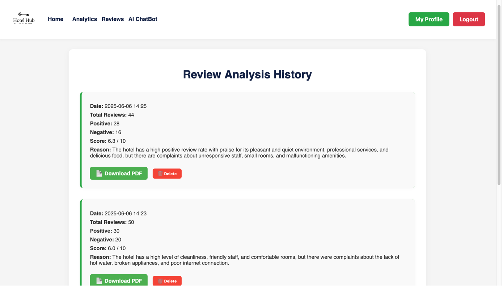

# 🏨 Hotel Management System

[](https://github.com/yilmazbugra/hotel-review-analyzer)
[](https://github.com/yilmazbugra/hotel-review-analyzer)
[](https://github.com/yilmazbugra/hotel-review-analyzer/issues)
[](https://github.com/yilmazbugra/hotel-review-analyzer/blob/main/LICENSE)

A comprehensive Flask-based hotel management system with advanced analytics, AI-powered chat bot, and review analysis capabilities.

**🔗 Repository**: [https://github.com/yilmazbugra/hotel-review-analyzer](https://github.com/yilmazbugra/hotel-review-analyzer)

## 📋 Table of Contents

- [Features](#features)
- [Screenshots](#screenshots)
- [Technology Stack](#technology-stack)
- [Installation](#installation)
- [Configuration](#configuration)
- [Usage](#usage)
- [Project Structure](#project-structure)
- [API Endpoints](#api-endpoints)
- [Demo Video](#demo-video)
- [Contributing](#contributing)
- [License](#license)

## ✨ Features

### 🔐 Authentication & User Management
- User registration and login system
- Role-based access control (Admin, Staff, User, Owner)
- User profile management
- Secure password handling with Flask-Bcrypt

### 📊 Analytics & Review Analysis
- Hotel review analysis with AI-powered insights
- Positive/negative sentiment analysis
- Keyword extraction from reviews
- Historical analytics dashboard
- Export functionality for analysis results

### 🤖 AI Chat Bot
- Interactive chat bot for customer service
- AI-powered responses for hotel inquiries
- Real-time chat interface

### 📅 Calendar Management
- Event scheduling system
- Calendar integration
- Booking management

### ⭐ Favorites System
- Save favorite hotels and analyses
- Personal collection management
- Quick access to saved items

### 👨‍💼 Admin Panel
- User management
- System administration
- Analytics overview
- Database management

## 📸 Screenshots

### Admin Panel

*Comprehensive admin dashboard for system management*

### Analytics Dashboard

*Advanced analytics interface with data visualization*

### Analysis Results

*Detailed review analysis results with sentiment breakdown*


*Comprehensive analytics with keyword analysis*

### Calendar System

*Interactive calendar for booking and event management*

### File Upload Interface

*User-friendly file upload system for data import*

### Favorites Management

*Personal favorites collection with quick access*

### Summary Reports

*Executive summary with key metrics and insights*


*Detailed summary report with comprehensive data*

### Main Interface

*Clean and modern main application interface*

## 🛠 Technology Stack

- **Backend**: Flask (Python)
- **Database**: MySQL
- **Frontend**: HTML, CSS, JavaScript
- **Authentication**: Flask-Login
- **Database ORM**: SQLAlchemy
- **Password Hashing**: Flask-Bcrypt
- **Migration**: Flask-Migrate
- **Database Driver**: PyMySQL

## 🚀 Installation

### Prerequisites
- Python 3.7+
- MySQL Server
- pip (Python package manager)

### Step 1: Clone the Repository
```bash
git clone https://github.com/yilmazbugra/hotel-review-analyzer.git
cd hotel-review-analyzer
```

### Step 2: Create Virtual Environment
```bash
python -m venv venv
source venv/bin/activate  # On Windows: venv\Scripts\activate
```

### Step 3: Install Dependencies
```bash
pip install -r requirements.txt
```

### Step 4: Environment Setup
1. Create a MySQL database named `hotel_system`
2. Copy the example environment file:
   ```bash
   cp config_example.py .env
   ```
3. Update the `.env` file with your actual configuration values:
   ```bash
   # Edit .env file with your actual values
   nano .env
   ```

### Step 5: Run the Application
```bash
python run.py
```

The application will be available at `http://localhost:5000`

## ⚙️ Configuration

### Environment Variables
The application uses environment variables for secure configuration. Create a `.env` file in the root directory:

```bash
# Copy the example file
cp config_example.py .env

# Edit with your actual values
nano .env
```

### Required Environment Variables
```env
# Flask Configuration
SECRET_KEY=your-secret-key-here
DEBUG=True

# MySQL Database Configuration
MYSQL_HOST=localhost
MYSQL_USER=root
MYSQL_PASSWORD=your-password
MYSQL_DB=hotel_system

# API Keys
OPENAI_API_KEY=your-openai-api-key-here
```

### Security Notes
- ⚠️ **Never commit your `.env` file to version control**
- 🔒 Keep your API keys and passwords secure
- 🛡️ Use strong, unique passwords for production
- 📝 The `.env` file is already included in `.gitignore`

## 📖 Usage

### User Roles
- **Admin**: Full system access, user management
- **Staff**: Limited administrative access
- **User**: Basic user functionality
- **Owner**: Hotel owner specific features

### Key Features Usage
1. **Registration/Login**: Create account or login with existing credentials
2. **Analytics**: Upload review data for AI-powered analysis
3. **Chat Bot**: Interact with AI assistant for hotel inquiries
4. **Favorites**: Save and manage favorite hotels and analyses
5. **Calendar**: Schedule and manage events and bookings

## 📁 Project Structure

```
hotel_system/
├── app/
│   ├── routes/          # Route handlers
│   ├── templates/       # HTML templates
│   ├── static/          # CSS, JS, images
│   ├── models.py        # Database models
│   ├── db.py           # Database configuration
│   └── __init__.py     # Application factory
├── screenshots/         # Application screenshots
├── config.py           # Configuration settings
├── requirements.txt    # Python dependencies
└── run.py             # Application entry point
```

## 🌐 API Endpoints

### Authentication Routes (`/auth`)
- `GET /` - Login page
- `POST /login` - User login
- `POST /register` - User registration
- `GET /logout` - User logout

### Analytics Routes (`/analytics`)
- `GET /` - Analytics dashboard
- `POST /analyze` - Perform analysis
- `GET /results` - View analysis results

### Admin Routes (`/admin`)
- `GET /` - Admin dashboard
- `GET /users` - User management
- `POST /users/create` - Create user
- `PUT /users/update` - Update user
- `DELETE /users/delete` - Delete user

### Chat Bot Routes (`/chat_bot`)
- `GET /` - Chat interface
- `POST /chat` - Send message

## 🎥 Demo Video

Watch our comprehensive demo video to see the Hotel Management System in action:

[](https://www.youtube.com/watch?v=lI4RI0b7MDw)

**Direct Link**: [https://www.youtube.com/watch?v=lI4RI0b7MDw](https://www.youtube.com/watch?v=lI4RI0b7MDw)

This video demonstrates all the key features including user management, analytics, chat bot functionality, and the admin panel.

## 🤝 Contributing

We welcome contributions to the Hotel Management System! Here's how you can contribute:

1. **Fork the repository** on GitHub
2. **Clone your fork** locally:
   ```bash
   git clone https://github.com/your-username/hotel-review-analyzer.git
   cd hotel-review-analyzer
   ```
3. **Create a feature branch**:
   ```bash
   git checkout -b feature/AmazingFeature
   ```
4. **Make your changes** and test them thoroughly
5. **Commit your changes**:
   ```bash
   git commit -m 'Add some AmazingFeature'
   ```
6. **Push to your branch**:
   ```bash
   git push origin feature/AmazingFeature
   ```
7. **Open a Pull Request** on GitHub

### Contribution Guidelines
- Follow the existing code style
- Add tests for new features
- Update documentation as needed
- Ensure all tests pass before submitting

**Repository**: [https://github.com/yilmazbugra/hotel-review-analyzer](https://github.com/yilmazbugra/hotel-review-analyzer)

## 📄 License

This project is licensed under the MIT License - see the LICENSE file for details.

## 📞 Support

For support and questions, please:
- Create an issue in the [GitHub repository](https://github.com/yilmazbugra/hotel-review-analyzer/issues)
- Contact the development team
- Check the [Wiki](https://github.com/yilmazbugra/hotel-review-analyzer/wiki) for additional documentation

---

**Built with ❤️ using Flask and modern web technologies**
